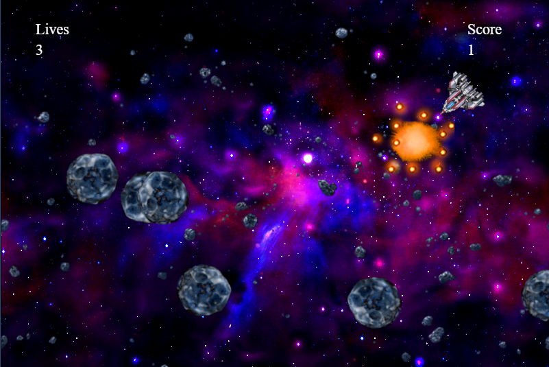

# By Abeer Mustafa
# About
My game has multiple rocks and multiple missiles. The player will lose a life if his ship collides with a rock and he will score points if his missile collides with a rock, he will keep track of the score and lives remaining and end the game at the proper time. The game contains animated explosions when there is a collision.
#
# Utilized
Python, CodeSkulptor
#
# I have designed my game after this amazing course:  
You can run the code on ': http://www.codeskulptor.org/#user47_bOadEW1ns2Orapf.py'
#

